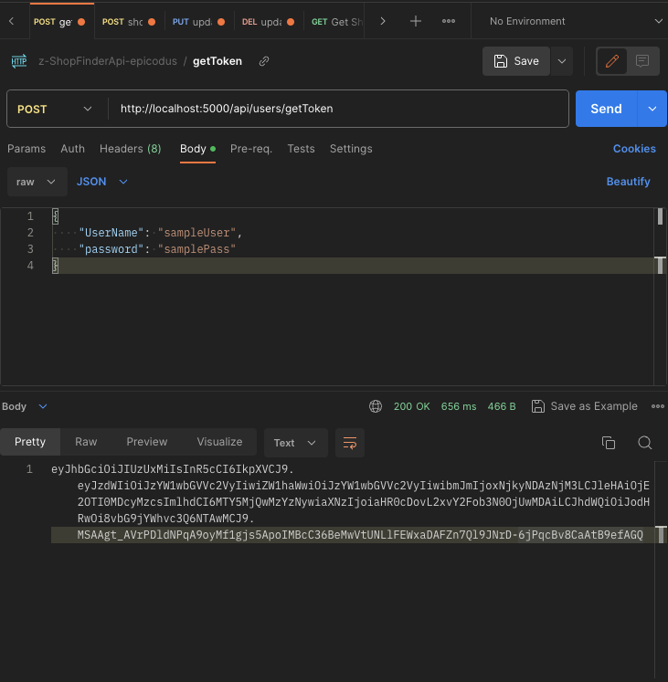

# _{Shop Finder API with Authentication, C#, .NET, Validation, Swagger Documentation and Entity Framework Core}_

#### By _**{Dan Kiss}**_


#### _{Shop Finder API with Authentication and Validation is an ASP.NET Core Web App using Entity Framework Core. It is written in C# and allows the user to connect to a MySQL database using API endpoints. See the folder ShopFinderApi, subfolder InformationalFiles and document Swagger UI ShowFinderApi.pdf. A default User, Shops and Restaurants are seeded into the database. The seeded user will to the api/users/getToken endpoint to get a JSON Web Token JWT and then be able to have Create, Read, Update and Destroy CRUD functionality with Shops and Restaurants. (You can also manually add a user to the Users table in MySQL and get a token associated with that new user.) The program will store added Shops and Restaurants. A recommended program for testing the api endpoints is Postman.}_

## Technologies Used

* ASP.NET Core Web Api
* Entity Framework Core
* Authentication with JSON Web Token JWT
* MySQL
* MySQL Workbench
* .NET Core
* .NET CLI
* C#
* Postman for Api calls and testing controller business logic

## Description

To run the application navigate to the ShopFinderApi folder in the command line and add a file named appsettings.json that is filled in as below, change [username] and [password] including removing the bracket to the username and password you have in MySQL server. MySQL server must be installed on your machine to run this project. You can optionally change the Key value below to a different one as well.

```
{
  "ConnectionStrings": {
    "DefaultConnection": "Server=localhost;Port=3306;database=shop_finder_api;uid=[username];pwd=[password]"
  },
  "Jwt": {
    "Issuer": "http://locahost:5000",
    "Audience": "http://locahost:5000",
    "Key": "shopfinderapikeysupersecret"
  }
}
```

Once you have set up appsettings.json while in the ShopFinderApi folder run 

$ dotnet restore

Now add the database called shop_finder_api and see it in MySQL Workbench.

In the Factory folder run the migration
$ dotnet ef database update

If wanted to add new columns in MySQL make a new migration and run the command below, change [DescribeYourMigration] to a description you like and remember to commit the changes. 

$ dotnet ef migrations add [DescribeYourMigration]

To include the new database migration again run

$ dotnet ef database update

Database Tables


After you are finished with the above steps, go to MySQL the Navigator > Schemas tab. Right click and select Refresh All. Our new test database and tables will appear.

Now go to the ShopFinderApi folder and run

$ dotnet watch run

As Entity Framework Core is used with the standard naming convention there is not testing added as there is not unique functions used that should be tested.

## Setup/Installation Requirements

* _navigate to the Factory folder and run_
* _$ dotnet restore_
* _Run $ dotnet watch run_
* _Go to this URL to see the Swagger Docs http://localhost:5000/swagger/index.html_
* _To get a token and be able to create a shop go to Postman and make a POST request to http://localhost:5000/api/users/getToken and go in Postman to Body and add { "UserName": "sampleUser", "password": "samplePass" } click send and grab the token returned from the response body_ 

* _Now you can create a Shop, make a POST request to http://localhost:5000/api/shops and include the token in the Authorization tab of Postman as type Bearer Token also to the Body of this request add { "description": "DogLandSuperStore","rating": 5 } and click Send_


* _You will get 201 response that the Shop has been created_
* _To update a shop in Postman make a PUT request to http://localhost:5000/api/shops/1 and go to authorization, add the bearer token and add the following JSON body { "shopid": 1, "description": "DogLandz", "rating": 5 } click send note the shopid and url endpoint are both using 1 in this example_
* _To delete a shop in Postman make a DELETE request to http://localhost:5000/api/shops/7 and go to authorization, add the bearer token click send_
* _You can do the same with restaurants, see the swagger docs for more detail at http://localhost:5000/swagger/index.html_

* _Note for CRUD actions, you need a User to have CUD actions, you can R without a User but a User is recommended_

_{Double check that the bin and obj folders are created in the ShopFinderApi folder}_

## Known Bugs

* _None_

## Idea to expand on

* _Make it so that an account is associated with a shop so only the account owner or an admin user can edit the shop once made.
* _Make a appsettings.Development.json file
{
  "Logging": {
    "LogLevel": {
      "Default": "Information",
      "Microsoft": "Trace",
      "Microsoft.AspNetCore": "Information",
      "Microsoft.Hosting.Lifetime": "Information"
    }
  }
}

## Notes on project

* _There is validation that you are adding details when creating the shop or restaurant_
* _The naming convention for Entity Framework Core must be followed in the model so the controllers work, note the Authorize keyword is setting up the authorization_
* _JWT authorization setup was helped by https://medium.com/bina-nusantara-it-division/implementing-jwt-in-asp-net-core-6-0-web-api-c-3a396fa8cfeb_
* _.NET CLI was used to make initial project structure $ dotnet new webapi -o ShopFinderApi --framework net6.0_
* _The packages you need are in ShopFinderApi.csproj_
* _For Entity Framework Core, we use a tool called dotnet-ef to create migrations and update our database. We'll install this tool globally so that it is always available in all of our projects. Run the following command in your terminal now $ dotnet tool install --global dotnet-ef --version 6.0.0_
* _In order to use dotnet-ef, we also need to install the Microsoft.EntityFrameworkCore.Design package in our ASP.NET Core projects. Within the production directory of our To Do List app, run the following command $ dotnet add package Microsoft.EntityFrameworkCore.Design -v 6.0.0_

## Git Note
Remove bin and obj folders from git with 

$ git rm --cached obj -r 

$ git rm --cached bin -r

## License

_{MIT License}_

Copyright (c) _2023_ _Daniel Kiss_